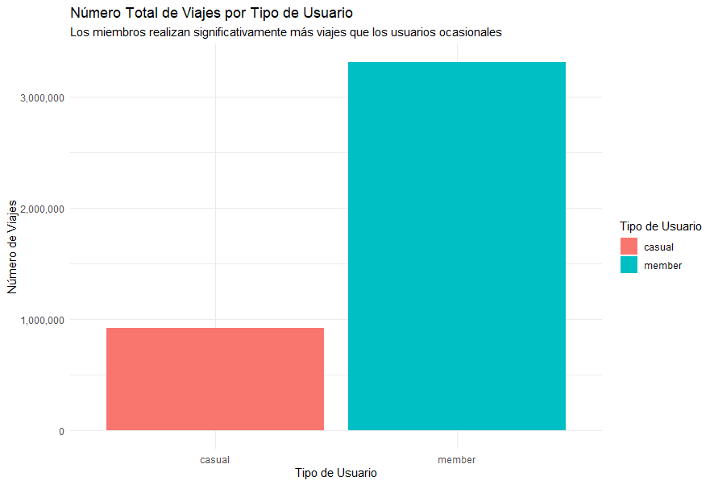
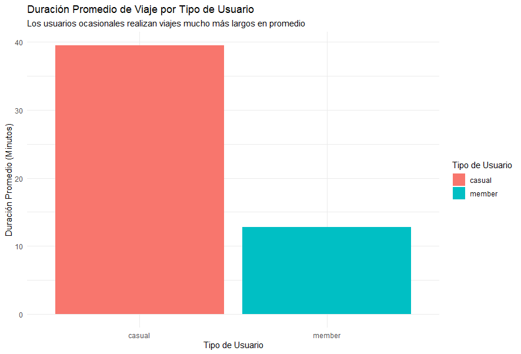
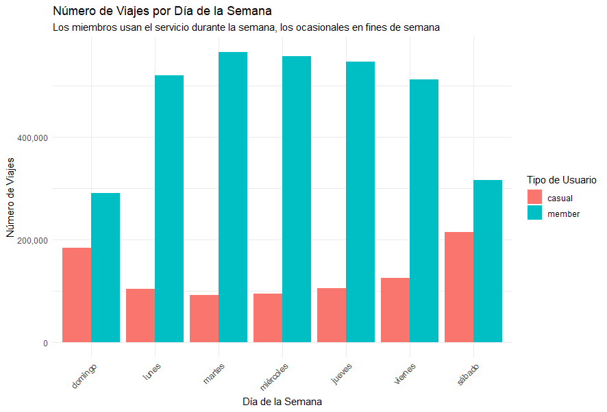

# Análisis de Caso: Cyclistic Bike-Share

Este repositorio contiene el análisis de datos para el caso de estudio de Cyclistic, parte del Certificado Profesional de Análisis de Datos de Google.

## 1. Objetivo del Negocio
El objetivo es analizar los datos históricos de viajes de Cyclistic para entender las diferencias clave entre los ciclistas ocasionales (`casual`) y los miembros anuales (`member`), con el fin de diseñar una estrategia de marketing para convertir a los usuarios ocasionales en miembros.

## 2. Hallazgos Clave
Tras el análisis, se encontraron tres patrones de comportamiento distintivos:
* **Volumen de Uso:** Los miembros utilizan el servicio con una frecuencia mucho mayor que los usuarios ocasionales.
* **Duración del Viaje:** Los usuarios ocasionales realizan viajes significativamente más largos en promedio.
* **Patrón Semanal:** El uso de los miembros es constante durante la semana laboral (sugiriendo traslados al trabajo), mientras que el uso de los ocasionales se dispara los fines de semana (sugiriendo ocio).

## 3. Recomendaciones Estratégicas
Basado en los hallazgos, se proponen las siguientes acciones:
1.  **Campaña de "Membresía para Commuters":** Enfocada en los beneficios de costo para viajes diarios al trabajo.
2.  **Creación de un "Pase de Fin de Semana":** Un producto de menor costo para atraer a los usuarios de ocio.
3.  **Promoción Post-Viaje:** Ofrecer un descuento en la membresía anual a los usuarios ocasionales justo después de que completen un viaje largo.

## 4. Herramientas Utilizadas
* **Lenguaje:** R
* **Paquetes:** `tidyverse` (para manipulación de datos), `ggplot2` (para visualizaciones)
* **Entorno:** RStudio / Jupyter Notebook

---
*El análisis completo, incluyendo el proceso de limpieza y el código, se puede encontrar en el siguiente cuaderno: [Cyclistic_Case_Study.ipynb](cyclistic_case_study.Rmd)*
